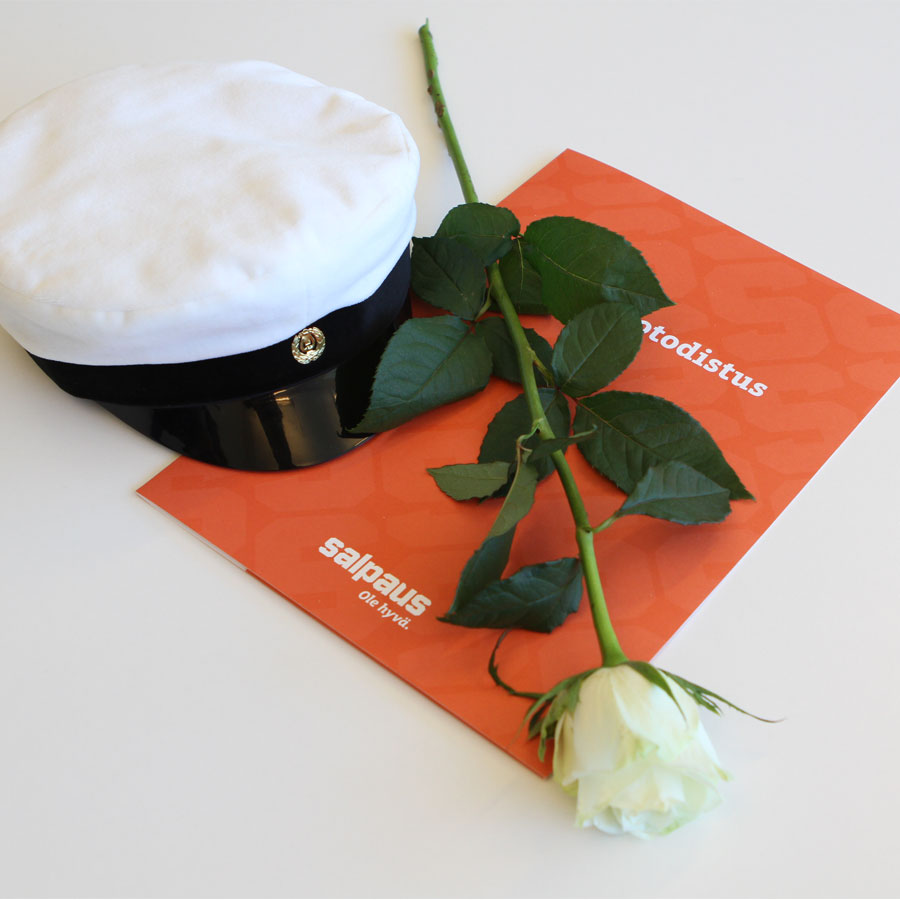
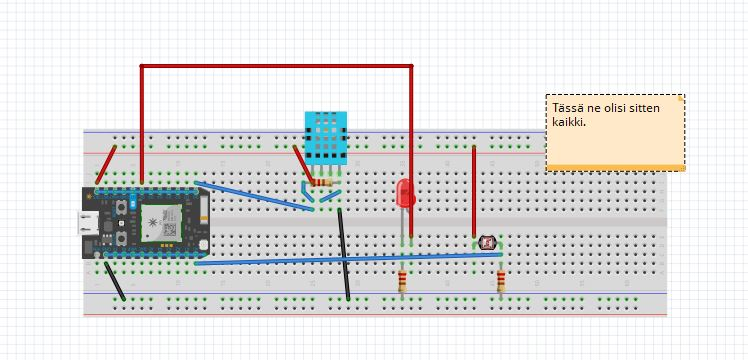
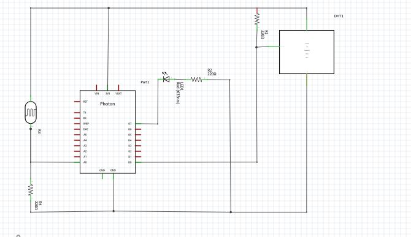

# Ilmiöt
# Alan toimintaympäristöt ja ilmiöt
Tekstiä voi kirjoittaa vaikka **lihavoituna**, *kursivoituna* tai ~~yliviivattuna~~   

Rivinvaihto tehdään kahdella välilyönnillä. 

Erilaisia otsikoita voi tehdä laittamalla # merkkejä peräkkäin:  
# 1. tason otsikko
## 2. tason otsikko
### 3. tason otsikko
#### 4. tason otsikko
##### 5. tason otsikko
###### 6. tason otsikko

Listoja voit tehdä näin: Eli tahdellä *
* Listan ensimmäinen elementti
* Listan toinen elementti
* Listan kolmas elementti
  * Kolmannen elementin ensimmäinen alielementti <!--Kaksi tabia sisennetty-->
  * Kolmannen elementin toinen alielementti
  
Numeroitu lista:
1. Eka juttu
1. Toka juttu
1. Kolmas juttu
   1. Kolmannen eka juttu <!--Kolme tabia sisennetty-->
   1. Kolmannen toka juttu
   
Readme.md -tiedostoon voi laittaa myös kuvia.
 


Linkitkin toimii:
http://google.com (automaattisesti)  
[Google](http://google.com) 

Näinkin voi tehdä
> Kirjoitetaan tähän tekstiä  
> Tähän lisää tekstiä

Tässä tapauksessa teksti tulee laatikkoon, tätä käytetään usein koodin kirjoittamiseen Readme.md -tiedostossa:
````
function kirjoitaTeksti(kirjoita)
 if(kirjoita) {
  console.log("parametri oli tosi")
 }
````
Taulukon sarakkeen otsikko | Seuraavan sarakkeen otsikko 
-------------------------|-----------------------
ABC | 123
XYZ | 456  

Voit myös kokeilla erilaisia emojeja :nerd_face: googlaa GitHub README.md emoji.   


# Sääaasema
## vaatimusmäärittely
### sovelluksen tarkoitus
* mitataan ympäristön lampötila -ja ilmankosteustietoja
* saatuja tietoja voidaan tarkastella tekstinä ja grafiikkana web sovelluksella

### käyttäjät
Web sovellus on tarkoitettu julkiseen käyttöön.

### käyttöliittymä
käyttöliittymä koostuu kahdesta näkymästä:
1. tekstimuotoisen datan selaamiseen tarkoitettu näkymä
1: grafiikkamuotoisen datan selaamiseen tarkoitettu näkymä

### jatkokehitysideoita
Säätietojen selaaminen valitulla aikavälillä.

## Arkkitehtuurikuvaus

### Luokkakaavio


### Sekvenssikaavio

## Työaikakirjanpito

päivä | aika | tehtävät
-----------|--------|-----
10.11 | 2h | Projektin suunnittelu
24.11 | 3h | Laitteiston asennus
25.11 | 2h| Ohjelmointi
01.12 | 5h | Testaaminen ja dokumentointi
08.12 | 9h | Käyttökoulutus
04.11 | 1h | Ledin kytkentä, Ledin vilkuttaminen
3.11 | 1h | Ledin kontrollointi selainpohjaisella järjestelmällä
3.11 | 1h | Valoisuuden mittaaminen photosensorilla
18.11| 4h | Lämpötilan ja kosteuden mittaaminen
19.11 | 2h |HTML opettelua
Yht | 37 | 

## työvaiheet

### Vaihe 1, Ledin kytkentä


### Vaihe 2, Ledin vilkuttaminen


````

//asetetaan oikeat pinnit

int led1 = D6;
int led2 = D7;

//kerrotaan pinneille että tarkoitus syöttää virtaa niihin.

void setup()
  {
  pinMode(led1, OUTPUT);
  pinMode(led2, OUTPUT); 

  }

//ja loopilla päättymättömästi toistaa virransyöttöä 1000 millisekunnin tauoilla.
void loop() 
  {
  digitalWrite (led1, HIGH);
  digitalWrite (led2, HIGH);

  delay(1000);

  digitalWrite (led1, LOW);
  digitalWrite (led1, LOW);

  delay (1000);

  }
````


### Vaihe 3, Ledin kontrollointi selainpohjaisella järjesetelmällä

````


int led1 = D6;
int led2 = D7;


void setup() 
{
    pinMode (led1, OUTPUT);
    pinMode (led2, OUTPUT);
    
    Particle.function ("led",ledToggle);
    
    digitalWrite (led1, LOW);
    digitalWrite (led2, LOW);
    
}

void loop()
{
    //mitähän varten tämä looppi kirjoitetaan tänne vaikkei sille anneta mitään komentoa?

}

int ledToggle(String command)
{
    if (command=="on"){
        digitalWrite(led1,HIGH);
        digitalWrite(led2,HIGH);
        return 1;
    }
    else if (command=="off") {
       digitalWrite(led1,LOW);
       digitalWrite(led2,LOW);
        return 0;    
    }
    
    else {
        return -1;
    }
}

````
#### TähänSittenJoskusSeHtmlKoodi

````

<html>
  <head>
   <meta charset="UFT-8" />
 </head>
<body>
   <center>
    <br />
    <br />
      <br />
   <form action="https://api.particle.io/v1/devices/PHOTONIN_ID/led?access_token=ACCESS_CODE" method="post"> LED:n kontrollointi web-käyttöliittymällä
<br />
<br />
<input name="arg" type="radio" value="on" />
Sytytä LED.
<br />
<input name="arg" type="radio" value="off" />
Sammuta LED:
<br />
<br />
<input type="submit"  value="valmis" />
</form> 
</center>
</body>
</html>


````


### Vaihe 4, Valoisuuden mittaaminen phototransistorilla


````

int led = D6;

int photosensor = A0;

int analogvalue;

int ledToggle(String command);

void setup() {

    Serial.begin();
    
    pinMode(led, OUTPUT);
    digitalWrite(led, HIGH);
    
    Particle.variable("analogvalue", &analogvalue, INT);
    
    Particle.function("led", ledToggle);
}

void loop() {
    
    analogvalue = analogRead(photosensor);
    
    Serial.printlnf("%d", analogvalue);
    
    delay(100);

}

int ledToggle(String command) {
    if (command=="on"){
        digitalWrite(led,HIGH);
        return 1;
    }
    else if(command=="off") {
        digitalWrite(led,LOW);
        return 0;
    }
    else {
        return -1;
    }
}


````
#### JaTämmöinenValonMääräVastausTuli

````
{"cmd":"VarReturn","name":"analogvalue","result":1,"coreInfo":{"last_heard":"2020-11-09T12:27:55.521Z","connected":true,"last_handshake_at":"2020-11-09T12:27:52.705Z","deviceID":"OMAN_PHOTONIN_ID","product_id":6}}

````

### Vaihe 5, Lämpötilan ja kosteuden mittaaminen


````
// This #include statement was automatically added by the Particle IDE.
#include <Adafruit_DHT_Particle.h>

#define DHTPIN D0

#define DHTTYPE DHT11

double temperature;

double humidity;

DHT dht(DHTPIN, DHTTYPE);

// Lisätty oikea kirjasto ja määritelty photonin pinnit.


void setup() {

  dht.begin();

  Particle.variable("temperature", temperature);

  Particle.variable("humidity", humidity);

}

// Setuppi toiminolle mittaamiseen.


void loop() {

  float h = dht.getHumidity();

  float t = dht.getTempCelcius();

  float f = dht.getTempFarenheit();

  temperature=t;

  humidity=h;

  if(isnan(h) || isnan(t) || isnan(f)) {

    Serial.println("Failed to read from DHT sensor!");

    return;

  }
  
  // Looppi jotta toistaa annettua komentoa.

  float hi = dht.getHeatIndex();

  float dp = dht.getDewPoint();

  if (dp != dp) {

      // get rid of NaN

      dp = 0;

  }

  float k = dht.getTempKelvin();

  Particle.publish("readings", String::format("{\"Hum(\%)\": %4.2f, \"Temp(°C)\": %4.2f, \"DP(°C)\": %4.2f, \"HI(°C)\": %4.2f}", h, t, dp, hi));

  delay(6000);

}


````

### Vaihe6?( vai meneekö nämä vielä tuon viitosen alle?), Koko asema nipussa.





````
// This #include statement was automatically added by the Particle IDE.
#include <Adafruit_DHT_Particle.h>

#define DHTPIN D0

#define DHTTYPE DHT11

double temperature;

double humidity;

DHT dht(DHTPIN, DHTTYPE);

int led = D6;

int photosensor = A0;

int analogvalue;

int ledToggle(String command);

void setup() {

  dht.begin();

  Particle.variable("temperature", temperature);

  Particle.variable("humidity", humidity);
  
  Serial.begin();
    
    pinMode(led, OUTPUT);
    digitalWrite(led, HIGH);
    
    Particle.variable("analogvalue", &analogvalue, INT);
    
    Particle.function("led", ledToggle);

}

// loop() runs over and over again, as quickly as it can execute.

void loop() {

  float h = dht.getHumidity();

  float t = dht.getTempCelcius();

  float f = dht.getTempFarenheit();

  temperature=t;

  humidity=h;

  if(isnan(h) || isnan(t) || isnan(f)) {

    Serial.println("Failed to read from DHT sensor!");

    return;

  }

  float hi = dht.getHeatIndex();

  float dp = dht.getDewPoint();

  if (dp != dp) {

      // get rid of NaN

      dp = 0;

  }

  float k = dht.getTempKelvin();

  Particle.publish("readings", String::format("{\"Hum(\%)\": %4.2f, \"Temp(°C)\": %4.2f, \"DP(°C)\": %4.2f, \"HI(°C)\": %4.2f}", h, t, dp, hi));

    analogvalue = analogRead(photosensor);
    
    Serial.printlnf("%d", analogvalue);
    
    
  delay(6000);

}

int ledToggle(String command) {
    if (command=="on"){
        digitalWrite(led,HIGH);
        return 1;
    }
    else if(command=="off") {
        digitalWrite(led,LOW);
        return 0;
    }
    else {
        return -1;
    }
}


````
### vaihe 7(ehkä), WebbiSivunRakentaminen.

#### Oma Nettisuvu (eli sen HTLM koodi)

````
<!DOCTYPE html>
<html>
  <head>
    
    <title>Mun Blogi</title>
    <meta name="descriptition" content="awesome blog by mää">
    <meta name="keywords" content="web suunnitteua, web dev ext">
    <style type="text/css">
    
      #main-header{ 
        text-align:center;
        backraound-colour:black;
        colour:white;
        padding:10px;

      }

      #main-footer{
        text-align:canter;
        font-size:18px;

      }

    </style>
    
  </head>
  <body>
    <header id="main=header">
      <h1>Mun nettisaitti</h1>
    </header>

    <a href="file:///C:/Users/K%C3%A4ytt%C3%A4j%C3%A4/OneDrive%20-%20Koulutuskeskus%20Salpaus/Koodauksia/Blogi.html/indexi2.html">go to index</a>

    <section>   
      <article class="post">
        <h3>Bio</h3>
        <small>Posted by Tommi on Nov 19</small>
        <p>Hei! Olen 47v Ensihoitaja Orimattilasta. Työskentelen Keski-Uudenmaan pelastuslaitoksella Kerava-Tuusula paloasemalla. Olen väsynyt työhoni ja haluan nukkua yöni</p>
        <a href="post.html"></a>

        
        </p>
      </article>
        <a href="kuvA.jpeg">
          

        </a>
      <article class="post">
        <h3>Harrastukset</h3>
        <small>Posted by Tommi on Nov 19</small>
        <p>Olen innokas kalastaja ja vuosien tahkomisen jälkeen sekin into palkittiin tänä syksynä. Joukkueemme voitti Järvilohikalojen vetouistenut Suomen mestaruuden 2020!</p>

        <!--tänä alle voisi laittaa linkin tuloksiin-->

        <a href="http://www.vetouistelu.com/JL2020-2/Paijanne-2020-2-lopputulokset.pdf">Lue Lisää</a> 

        <br>

        <a href="Lohi.jpg">
          

        </a>

        
        </p>
        <article class="post">
        <h3>Opiskelu</h3>
        <small>Posted by Tommi on Nov 19</small>
        <p>Koska olen hieman väsynyt työhöni, olen siis lähtenyt opiskelemaan ITC alaa. Ensimmäisinä töinä on rakentaa Sääasema Particlen Photon- Iot alustalle ja tuottaa sille oma webbisivu josta sen mittauksia pääsee tutkimaan netistä. alla linkki sääaseman sivulle.  </p>
        <a href="post.html">Lue Lisää</a>
        
        </p>
      </article>
      </article>
    </section>

  
  <footer id="main-footer">
    <p>Copyright &copy; 2019 Mun Nettisaitti </p>

    <form action="prosess.php" method="POST">
       <br>
      <div>  
        <label>Ota halutessasi yhteyttä</label>
        <textarea name="Viesti"></textarea>
      <div>  
       <br>
       <input type="submit" name="submit" value="lähetä">
    </form>

  </footer>
  </body>
</html>

````

#### Sääaseman nettisivu (eli sen HTLM koodi)

Ja perässä sääaseman HTML. nythän on niin että ne linkittyy toisiinsa kyllä tässä omalla koneella kun ei ne oo missään muualla verkossa. Ehkä joskus opin miten ne laitettan linkittyy verkossa. :)


````

<!DOCTYPE html>
<html>

<head>
	<meta charset="utf-8">
	<meta name="viewport" content="width=device-width">
	<title>repl.it</title>
	<link href="style.css" rel="stylesheet" type="text/css" />
</head>

<body>
	<script src="script.js">
	</script>
</body>

</html>

<!DOCTYPE html>
<html>
  <head>
    
    <title>Mun Blogi</title>
    <meta name="descriptition" content="awesome blog by mää">
    <meta name="keywords" content="web suunnitteua, web dev ext">
    <style type="text/css">
    
      #main-header{ 
        text-align:center;
        backraound-colour:black;
        colour:white;
        padding:10px;

      }

      #main-footer{
        text-align:canter;
        font-size:18px;

      }

    </style>
    
  </head>
  <body>
    <header id="main=header">
      <h1>Tommin sääasema</h1>
    </header>

    <a href="file:///C:/Users/K%C3%A4ytt%C3%A4j%C3%A4/OneDrive%20-%20Koulutuskeskus%20Salpaus/Koodauksia/Blogi.html/indexi2.html">palaa kotisuvulle</a>

    <br>
    <br>
    
 <center>
  <TABLE BORDER=16 sumary="kaksi riviä ja kolme saraketta"> 
    
      <CAPTION VALIGN=TOP  ALIGN=CENTER>Tommin sääasema </CAPTION>
      <TR colspan="30"><TH> Lämpötila </TH><TH> Kosteus % </TH><TH> Valoisuus </TH>
      <TR><TD> Arvo °C </TD><TD> Arvo % </TD><TD> Arvo lux? </TD>
  </TABLE>

  </center>
````

##  Käyttöohje

### Järjestelmän konfigurointi
Lataa node_modules

````
 npm install 

````
Käynnistä projekti paikallisesti portiin 3000

````
 npm start
 
````


